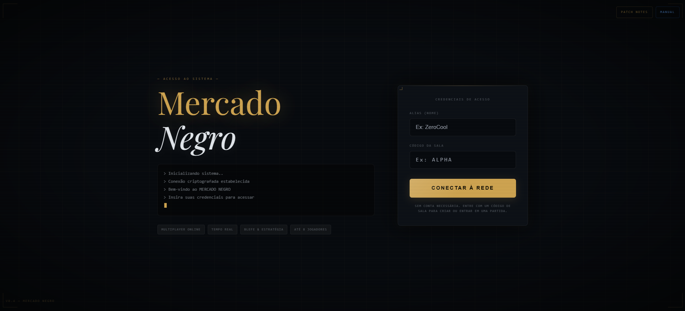
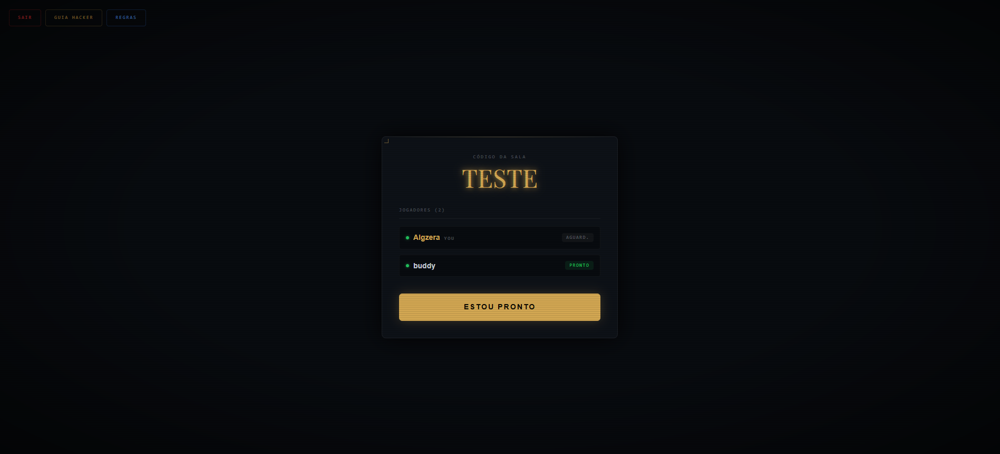
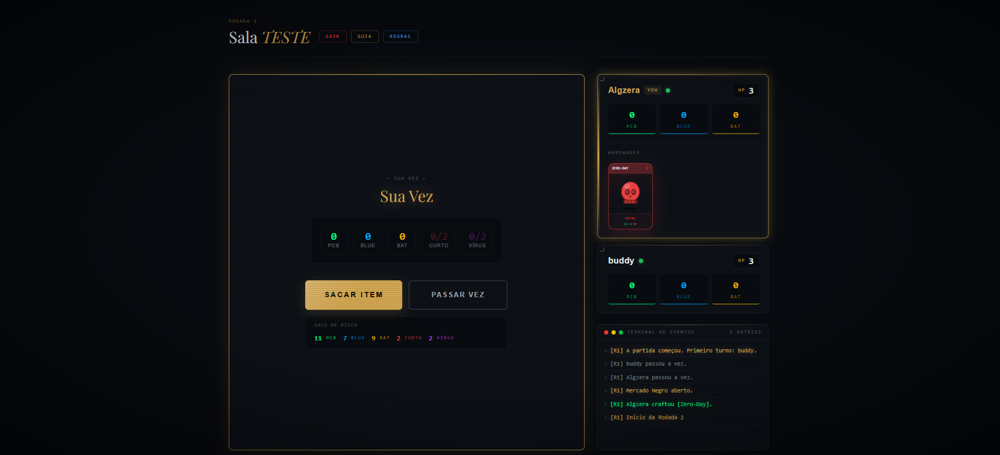
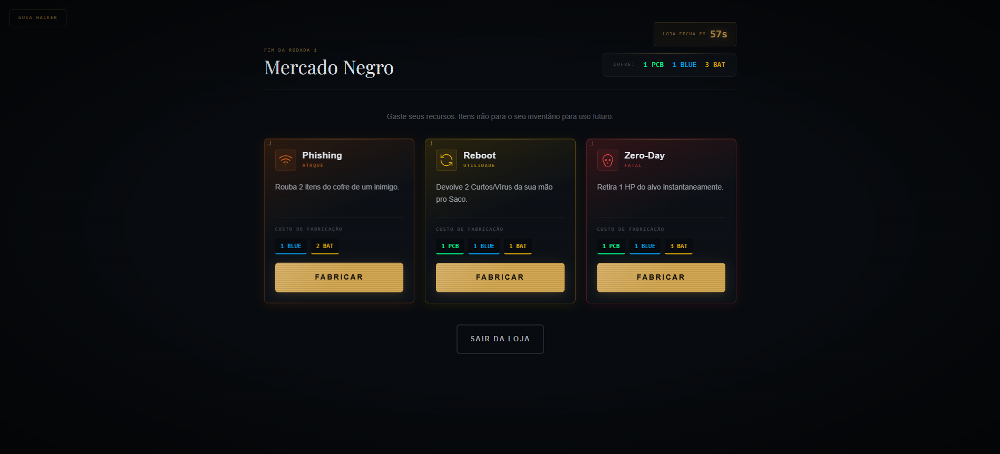

# Saco de Risco

[Português](README.pt-BR.md) | [English](README.md)

<p align="center">
  
</p>

<p align="center">
  <em>Não é só probabilidade. É psicologia, tensão e a decisão certa na hora errada.</em><br>
  <strong>Um jogo multiplayer em tempo real de estratégia e risco, inspirado na estética de cassinos clandestinos e terminais corporativos cyberpunk.</strong>
</p>

<p align="center">
  
  
  
  
  
  
  
</p>

---

## O que é isso?

**Saco de Risco** é um jogo de mesa digital, multijogador e em tempo real. Os jogadores assumem o papel de hackers em uma mesa de apostas de alto risco, onde cada rodada exige uma escolha: extrair mais componentes do saco ou sair com o que você já tem antes que tudo exploda.

A ganância mata. Mas a cautela excessiva te deixa sem recursos. Você decide.

> **Nota:** O jogo funciona melhor em redes estáveis. Como o estado é sincronizado em tempo real via Supabase, conexões instáveis podem causar atraso entre os jogadores.

## Funcionalidades

| Feature | Descrição |
|---------|-----------|
| ⚡ **Tempo Real** | Estado da mesa sincronizado instantaneamente para todos os jogadores via Supabase Realtime. |
| 🃏 **Sistema de Cartas** | Itens do inventário renderizados como cartas de baralho estilo TCG com ícones, tipos e animações de hover. |
| 🛒 **Mercado Negro** | Fase de crafting entre rodadas com timer de 60 segundos — compre armas, curas e utilidades com seus recursos. |
| 💥 **Feedback Visual** | Screen shake ao tomar dano, efeito glitch em ataques em área, flash de carta ao sacar itens do saco. |
| 🔊 **Áudio Sintetizado** | Sons gerados via Web Audio API — sem arquivos externos, zero latência. |
| 🎲 **Ordem Justa** | Primeiro jogador de cada partida e início de cada rodada sorteados aleatoriamente. |
| 📋 **Log de Partida** | Terminal de eventos em tempo real e pódium completo com histórico ao fim do jogo. |
| 📱 **Responsivo** | Interface otimizada para desktop e mobile. |

## O Jogo

### Loop Principal

```text
Lobby (todos marcam Pronto)
        │
        ▼
Rodada começa com um jogador sorteado aleatoriamente
        │
        ▼
Seu turno: Sacar item do saco  ──►  Material bom? → acumula na mão
        │                           Curto-Circuito? → 1 tudo bem, 2 = 💥 -1 HP
        │                           Vírus? → 1 tudo bem, 2 = 🦠 perde a vez
        ▼
Passar a vez → materiais vão pro Cofre, ameaças voltam pro Saco
        │
        ▼
Todos jogaram uma vez → Mercado Negro (60s) → crafta itens com recursos
        │
        ▼
Nova rodada com um starter diferente → repete até restar 1 jogador
```

### Itens do Mercado Negro

| Item | Tipo | Efeito |
|------|------|--------|
| 🛡️ Firewall | Defesa | Absorve 1 dano letal ou ataque. Quebra após uso. |
| 💉 Patch de Seg. | Cura | Recupera +1 HP instantaneamente. |
| 🌐 VPN | Utilidade | Pula seu turno com segurança, guardando tudo. |
| 🔁 Reboot | Utilidade | Devolve 2 Curtos/Vírus da mão pro Saco. |
| 🎯 Trojan | Ataque | Força um inimigo a sacar 3 vezes no próximo turno. |
| 📡 Phishing | Ataque | Rouba 2 recursos do cofre de um inimigo. |
| 💀 Zero-Day | Fatal | Retira 1 HP de um alvo instantaneamente. |
| 🌐 DDoS Automático | Fatal | Aplica +2 saques obrigatórios em TODOS os inimigos. |
| 🔒 Ransomware | Fatal | Rouba 1 HP de um alvo (cura você ao mesmo tempo). |
| 💣 Bomba Lógica | Fatal | Causa 1 dano a TODOS (incluindo você). Ignora Firewall. |

## Screenshots

| Tela Inicial | Lobby |
|:---:|:---:|
|  |  |
| **Partida em andamento** | **Mercado Negro** |
|  |  |

## Stack Técnica

- **Framework:** Next.js 15 (App Router) + TypeScript
- **Banco de Dados / Realtime:** Supabase (PostgreSQL + Realtime subscriptions)
- **Estilização:** Tailwind CSS + CSS custom properties
- **Animações:** Framer Motion
- **Ícones:** Lucide React
- **Áudio:** Web Audio API (sintetizador nativo, sem assets externos)
- **Deploy:** Vercel (CI/CD automático via GitHub)

## Desafios Técnicos

- **Race Conditions:** Lógica de turno com leitura fresh do banco antes de cada escrita para evitar conflitos quando múltiplos jogadores interagem simultaneamente.
- **Scroll indesejado:** O `scrollIntoView` do terminal de eventos estava movendo o `window` inteiro. Resolvido com `scrollTop` direto no container interno.
- **Ordem de turno justa:** Sistema de `turn_order` embaralhado e persistido no banco, com índice rotativo entre rodadas para garantir que nenhum jogador abre duas rodadas seguidas.
- **Timer sincronizado:** Countdown local de 60s no Mercado Negro com `clearInterval` seguro e fallback para `handleFinishCrafting` automático.

## Como Rodar Localmente

```bash
# 1. Clone o repositório
git clone https://github.com/samu-lls/saco-de-risco.git

# 2. Instale as dependências
npm install

# 3. Configure as variáveis de ambiente
cp .env.example .env.local
# Edite .env.local com suas credenciais do Supabase:
# NEXT_PUBLIC_SUPABASE_URL=sua_url
# NEXT_PUBLIC_SUPABASE_ANON_KEY=sua_chave

# 4. Rode o servidor de desenvolvimento
npm run dev
```

Acesse `http://localhost:3000`, abra em duas abas com nomes diferentes e crie uma sala para testar o multiplayer localmente.

## Estrutura do Projeto

```text
saco-de-risco/
├── app/
│   ├── page.tsx                  # Tela inicial e login
│   ├── layout.tsx                # Layout raiz
│   ├── globals.css               # Design system e animações
│   └── room/[code]/
│       └── page.tsx              # Lógica completa da partida
├── components/
│   ├── PlayerPanel.tsx           # Card do jogador com inventário TCG
│   ├── ShopCard.tsx              # Card de item do Mercado Negro
│   └── TerminalLog.tsx           # Terminal de eventos em tempo real
└── lib/
    ├── items.ts                  # Definição dos 10 itens do jogo
    ├── patchnotes.ts             # Histórico de versões (editável)
    ├── sounds.ts                 # Sintetizador de áudio via Web Audio API
    └── supabase.ts               # Client Supabase configurado
```

## Sobre o Autor

Sou **Samuel**, Analista de TI e entusiasta de tecnologia. Desenvolvi o Saco de Risco como um projeto pessoal para explorar sincronização em tempo real, design de sistemas de jogo e a fronteira entre engenharia de software e experiência do usuário.

Se quiser conversar sobre desenvolvimento, jogos ou setups, vamos nos conectar.

## Contato

[](https://www.linkedin.com/in/samu-lls/)
[](https://www.behance.net/samuellelles)
[](mailto:samu.lls@outlook.com)
[](https://github.com/samu-lls)
